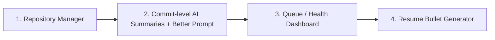

# DevLog — Final Polish Sprint Plan
**No Docker. No Kafka. No microservices. Just finishing what you already built, well.**

---

## 0. Why this document exists

You've built something genuinely uncommon for a student portfolio: an event-driven backend system (webhook → queue → worker → AI → published artifact) that happens to use AI, rather than an AI wrapper pretending to be a system. That distinction is the whole selling point of DevLog, and it's worth protecting.

This plan does three things:
1. Gives you a **tight, 4-item build list** — no bloat, no "nice someday" items sneaking into this week.
2. Gives you a **guided way to re-read your own codebase**, so you can actually explain the architecture in an interview instead of just having built it once and forgotten why.
3. Explains **who DevLog is actually for** and what it does for each of them — so every feature you build has a "for whom, and why" attached to it, not just "because it sounded cool."

Docker is explicitly **out of scope** for this sprint. Not because it's a bad idea — because your storage situation makes it a bad trade *right now*. It stays in the v2 backlog next to Kafka and microservices.

---

## 1. Who DevLog is actually for (and what it gives each of them)

Keep this section in your head while building — every feature should map to one of these three people.

### 🧑‍💻 Young / junior developers
**Problem:** Their GitHub is a wall of green squares and commit messages like `fix`, `update`, `wip`. Nobody can tell what they actually did or learned.

**What DevLog gives them:**
- A daily engineering journal that reads like a real logbook, generated from work they already did — zero extra effort.
- A way to *see their own growth* over weeks/months (this is why commit-level summaries and the eventual "technology timeline" matter — junior devs often can't articulate their own progress until it's laid out for them).
- Resume bullets they didn't have to sit and write badly at 1am before an application deadline.

### 🧑‍🔬 Senior developers / engineering managers
**Problem:** They don't want to read commit logs. They want signal: is this person shipping real work, is the work getting more complex over time, do they make sound architectural decisions.

**What DevLog gives them:**
- A structured, skimmable log instead of a raw git tree.
- Engineering *reasoning*, not just changelogs ("Redis introduced to decouple diff processing from the webhook request lifecycle" vs. "added redis") — this is the single feature that most changes how a senior reads the project, and it's just a prompt change, not new infrastructure.
- Standup-ready summaries if used internally on a team.

### 🎯 You (Adithya)
This is the part you flagged and it's the right instinct — **understanding your own system deeply is a deliverable in itself.** An interviewer will ask "walk me through what happens when someone pushes a commit," and the honest test isn't whether the feature works, it's whether you can explain *why* each piece exists without looking at the code. Section 5 below is built specifically to get you there.

---

## 2. The Sprint: 4 builds, in order, ~2–3 focused days

No Docker. No new infra. Everything below extends code you already have.



### 🥇 Build 1 — Repository Manager
**Fixes:** the real limitation your own Architecture Report flagged — you're hardcoded to "latest 8 repos, latest 5 commits," no user control.

**What it does:** After OAuth, fetch *all* the user's repos (not just 8), store them, and let the user toggle which ones are actively tracked. Only tracked repos get processed by the webhook/worker pipeline going forward.

**Why it's first:** Every other feature (commit summaries, dashboard, resume bullets) is more useful once the noise (repos you don't care about) is filtered out at the source.

**Build steps:**
1. **Schema:** add a `Repository` model —
   ```prisma
   model Repository {
     id          String   @id @default(uuid())
     userId      String
     user        User     @relation(fields: [userId], references: [id], onDelete: Cascade)
     fullName    String   // "chavaliadi/devlog"
     isTracked   Boolean  @default(false)
     lastSyncAt  DateTime?
     language    String?
     stars       Int?     @default(0)
     createdAt   DateTime @default(now())

     @@unique([userId, fullName])
   }
   ```
2. **Backend:** new route `GET /api/repos/sync-all` — calls GitHub API to list *all* repos (paginate if needed), upserts into `Repository` table with `isTracked: false` by default.
3. **Backend:** `PATCH /api/repos/:id/toggle` — flips `isTracked`.
4. **Backend:** update your webhook handler — before enqueuing a commit job, check `Repository.isTracked` for that repo; if false, discard the event early. This is the actual fix.
5. **Frontend:** simple settings page — list of repos with a toggle switch each, plus last-synced timestamp and language badge (you already have most of this data from the GitHub API response, just not persisted/exposed).

**Effort:** ~1 day.

---

### 🥈 Build 2 — Commit-level AI Summaries + "Why, not just What" Prompt
**Fixes:** the biggest content gap — right now 10 commits collapse into one daily paragraph, and even that paragraph only describes *what* changed, not *why*.

**What it does:** Two changes bundled together since they touch the same code path:
1. Generate a short AI summary **per commit**, in addition to the existing daily rollup.
2. Rewrite the summarization prompt to explicitly ask for engineering reasoning.

**Build steps:**
1. **Schema:** add a nullable field to `Commit` —
   ```prisma
   model Commit {
     // ...existing fields
     aiSummary   String?  // new: per-commit AI explanation
   }
   ```
2. **Backend:** new function `summarizeCommit(commit, diffText)` — calls Groq with a small, cheap prompt per commit (this is 1 commit's diff, not a whole day's payload, so it stays fast and cheap). Store result in `Commit.aiSummary`.
3. **Trigger point:** call this right after the diff is filtered and stored in your existing worker (`Worker->>DB: Save Commit & Code Diff` step in your architecture diagram) — so it happens once, at ingestion, not on every page load.
4. **Prompt rewrite** (this is the "why not what" fix) — change your daily-summary prompt from:
   ```
   Overview / Key Changes / Technical Details
   ```
   to something like:
   ```
   You are summarizing a developer's work for a technical audience.
   For each significant change, explain:
   - WHAT changed (one line)
   - WHY it likely changed — the engineering problem it solves
     (infer this from the diff + file context, don't guess wildly)
   Avoid restating commit messages. Avoid generic phrases like
   "improved code quality." Be specific to the actual diff.
   ```
5. **Frontend:** in the commit inspector drawer you already have, show `aiSummary` next to each commit instead of just the raw message.

**Effort:** ~1 day (mostly prompt iteration — expect to run it against 15–20 real commits and adjust wording until it stops sounding generic).

---

### 🥉 Build 3 — Queue / Health Dashboard
**Fixes:** nothing user-facing — this fixes *your* ability to prove the backend is real and operated, not just built once and left running.

**What it does:** A single `/health` or `/admin/status` page showing:
- BullMQ: waiting / active / completed / failed job counts
- Redis: connected (y/n), last ping latency
- Worker: last job processed timestamp, last error (if any)
- DB: connection status
- Cron: last scheduled run time, next scheduled run

**Build steps:**
1. **Backend:** BullMQ exposes queue introspection natively —
   ```ts
   const counts = await commitQueue.getJobCounts('waiting', 'active', 'completed', 'failed');
   ```
2. **Backend:** wrap this plus a Redis `PING` and a `SELECT 1` Postgres check into one `GET /api/health` endpoint returning JSON.
3. **Frontend:** a small dashboard page — a handful of stat cards is enough, this doesn't need to be beautiful, it needs to be *legible in a 30-second interview demo*.
4. **Optional nice touch:** auto-refresh every 5s with `setInterval` so it looks "live" when you demo it.

**Effort:** ~half a day. Highest interview-signal-per-hour item on this whole list — this is the thing that makes someone believe you understand distributed systems operationally, not just that you copy-pasted a queue library.

---

### 🏅 Build 4 — Resume Bullet Generator
**Fixes:** the gap between "I built a cool system" and "I have a sentence I can paste into a resume."

**What it does:** One button on a published entry (or a repo, or a date range) that calls Groq once more with a tightly-scoped prompt to produce 1–3 resume-style bullets from the underlying commits/diffs.

**Build steps:**
1. **Backend:** new route `POST /api/entries/:id/resume-bullets`.
2. **Prompt:**
   ```
   Based on the following commits and technical summary, write 1-3
   resume bullet points in the style of a software engineering resume.
   Use strong action verbs, include specific technologies, and where
   possible quantify impact (commits processed, latency, scale).
   Do not exaggerate beyond what the diffs support.
   ```
3. **Frontend:** button + a small modal showing the generated bullets with a copy-to-clipboard button.

**Effort:** ~half a day. This one is almost pure demo value for very little engineering — a good note to end the sprint on.

---

## 3. Suggested day-by-day schedule

| Day | Focus | Deliverable at end of day |
|---|---|---|
| Day 1 | Repository Manager (backend + schema) | Toggleable repo list working via API (Postman/curl test is fine) |
| Day 2 (AM) | Repository Manager frontend | Toggle UI wired up and tested end-to-end |
| Day 2 (PM) | Commit-level summaries — backend + prompt v1 | Per-commit AI summaries generating, even if wording is rough |
| Day 3 (AM) | Prompt iteration for "why not what" | Summaries you'd actually be proud to show a recruiter |
| Day 3 (PM) | Queue/health dashboard | `/health` endpoint + minimal frontend page |
| Day 4 (optional buffer) | Resume bullet generator | Working button + modal, then **stop** |

If Day 4 slips, cut the resume bullet generator before you cut anything else — it's the most skippable without weakening the core story.

---

## 4. Explicitly parked (do not build this sprint)

Write these into your README under a "Roadmap" heading so they read as intentional foresight, not as gaps:

- Folder-level ignore rules (repo-level toggle covers 80% of the value already)
- Weekly / monthly AI reports
- Skill extraction, architecture-pattern detection, commit clustering
- Docker Compose (blocked on your storage constraint — revisit once free space allows)
- Kafka event bus, microservices, CQRS, event sourcing, Kubernetes

A short, honest "Not yet, and here's why" in your README does more for credibility than half of these features actually implemented badly under deadline pressure.

---

## 5. Reading your own system — a guided pass

You said the real task is being able to *explain* your own architecture, not just have built it. Here's a structured way to re-read DevLog so you actually internalize it, rather than re-skimming files at random.

Do this **before** you touch new code — ideally in one sitting, 60–90 minutes, no interruptions.

### Pass 1 — Follow one commit end to end (30 min)
Literally trace a single real commit through your system, file by file, and write down what happens at each hop:

1. `git push` happens → which file receives the webhook? (`routes/webhook.ts` or similar)
2. How is the payload verified? (find your HMAC signature check — this is a real security mechanism, know exactly how it works)
3. Where does it get enqueued? (find the `Queue.add(...)` call)
4. What does the worker do first when it picks up the job? (find your `Worker` file, the `process` function)
5. Where does diff filtering happen? (`diffFilter.ts`) — read this file fully, it's small and it's a genuinely good design decision, know *why* each exclusion (lockfiles, binaries, minified JS) exists
6. Where does the filtered diff get saved? Which table, which fields?

**Output:** a hand-drawn or Mermaid diagram, from memory, that you check against your real code afterward. If it doesn't match, that's exactly the gap you needed to find.

### Pass 2 — Follow the AI compilation trigger (20 min)
1. What actually triggers a daily summary — cron, manual button, or both? Find both trigger points.
2. What does the DB query look like that pulls "today's commits"? (timezone handling matters here — you already have per-user timezone in the schema, understand how it's used in the query)
3. What's your actual prompt right now, verbatim? Copy it into a notes file. You're about to rewrite it — know what you're replacing.
4. What does Groq return, and how is it saved (draft vs published — where's that state machine)?

### Pass 3 — Follow the public portfolio path (15 min)
1. How does an unauthenticated visitor hit `#/portfolio/:username` without triggering your auth middleware? Find the specific route exclusion.
2. What data is actually exposed publicly vs. gated? Could a scraper get anything they shouldn't?

### Pass 4 — Write your own 60-second explanation
Without looking at code, write (or say out loud, recorded) a 60-second answer to: **"Walk me through what happens when I push a commit to a repo you're tracking."** If you hesitate on any step, that's the step to re-read.

This pass is also the best possible prep for Build 3 (the health dashboard) — you can't build good observability into a system you can't explain.

---

## 6. Demo script (for when the sprint is done)

Keep this short — 90 seconds, three beats:

1. **"This isn't an AI wrapper, it's an event pipeline."** Show the health dashboard live — queue depth, worker status. This is the credibility beat.
2. **"Here's a commit, and here's what my system inferred about *why* it exists, not just what it says."** Show one commit-level summary with the "why" reasoning visible.
3. **"And here's what a recruiter would actually see."** Open the public portfolio, show the resume bullet button generating something real, on the spot.

That's the whole pitch. Everything else in the parked list is optional depth for follow-up questions, not part of the core demo.
