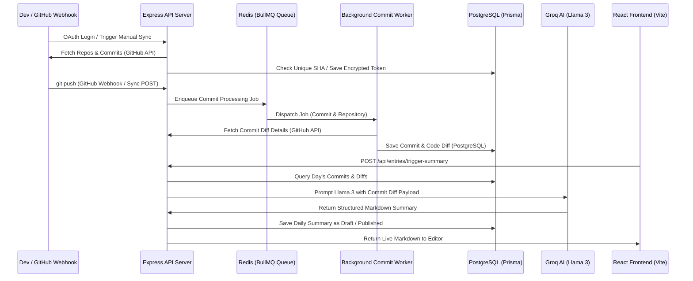

# Devlog 🚀
> **Automated developer portfolios compiled directly from Git commit history.**

Devlog is an intelligent full-stack application that translates complex, raw git commits and code diffs into clean, high-impact daily engineering journals designed for recruiters, hiring managers, and engineering leaders.

---

## 📖 Table of Contents
- [What is Devlog & Why Build It?](#-what-is-devlog--why-build-it)
- [Target Audience](#-target-audience)
- [Core Features](#-core-features)
- [System Architecture & Workflow](#-system-architecture--workflow)
- [Tech Stack & Architecture Purpose](#-tech-stack--architecture-purpose)
- [Database Schema Model](#-database-schema-model)
- [Prerequisites & Installation](#-prerequisites--installation)
- [Commands to Run](#-commands-to-run)
- [GitHub OAuth & Webhook Setup](#-github-oauth--webhook-setup)

---

## 💡 What is Devlog & Why Build It?
Developers write hundreds of commits and reviews, pushing thousands of lines of code. However, **recruiters and hiring managers do not have the time to read through raw commits, SHAs, or code diffs.** 

Historically, developers have had two subpar choices for showcasing their work:
1. **Raw GitHub Profiles:** Full of green contribution squares, but lacking context on *what* was actually accomplished or the *complexity* of the code written.
2. **Manual Portfolios:** Beautiful, but requiring constant manual updates, meaning they quickly get outdated and abandoned.

**Devlog bridges this gap.** It securely captures a developer's real-time git commit feed, pulls the specific code diffs, uses advanced LLMs (Groq AI) to summarize the technical contributions, and generates a structured public portfolio that reads like a professional engineering logbook.

---

## 🎯 Target Audience
* **Job-Seeking Software Engineers:** Showcase a dynamic, easy-to-read daily log of your technical contributions on your resume without manually writing portfolio updates.
* **Tech Recruiters & Sourcers:** Instantly evaluate candidate activity, tech stack depth, and the complexity of their contributions through readable logs instead of scanning GitHub repositories.
* **Engineering Managers:** Understand daily team impact and highlight weekly achievements during standups.

---

## 🛠️ Core Features
* 🔄 **On-Demand GitHub Sync:** Pull your active GitHub repositories and recent commits instantly with a single click.
* 📦 **BullMQ Asynchronous Queue:** Handles commit processing, queueing, and git diff analysis asynchronously via a decoupled Redis worker.
* 🤖 **AI Summary Compiler:** Uses Groq's Llama 3 engine to group daily commits, read code diffs, filter out boilerplate files, and write daily logs structured as *Overviews*, *Key Changes*, and *Deep Dives*.
* 🎨 **Premium Glassmorphic Dashboard:** Built with sleek dark-mode aesthetics, custom typography (Inter), responsive metric cards, and a split-screen live Markdown editor.
* 💼 **Recruiter-First Public Portfolio:** A non-gated recruiter gateway (`#/portfolio/:username`) allowing external visitors to view metrics, streak records, and read published daily logs in a smooth modal overlay without needing a GitHub login.
* 🔑 **Secure GitHub OAuth 2.0:** Secure login gateway using cookie-based session management, and `AES-256-GCM` authenticated encryption to protect stored GitHub Access Tokens.

---

## 🏗️ System Architecture & Workflow



### Ingestion Workflow
1. **Authentication:** The developer connects their GitHub account. The OAuth gateway exchanges the authorization code, encrypts the access token, and saves it in PostgreSQL.
2. **Manual Sync / Push Webhook:** The developer pushes code or clicks "Sync GitHub Commits". The backend registers these events.
3. **Queue Processing:** To handle heavy payload transfers, commits are pushed into a **Redis Queue** processed by **BullMQ**.
4. **Diff Retrieval:** The background worker pulls the job, fetches the specific file diffs using the developer's GitHub token, sanitizes/filters out binary metadata, and stores the commit details.
5. **Summarization:** When a summary is triggered (manually or via nightly cron), the backend compiles the code diffs for that day, prompts **Groq AI**, and saves the generated Markdown output to the database.

---

## 💻 Tech Stack & Architecture Purpose

### 1. Frontend (React, Vite, CSS)
* **Vite:** High-performance local development build tool, ensuring instant Hot Module Replacement (HMR) and optimized, small assets bundles.
* **React:** Client-side state handling for logs, Markdown editing, and live sync status.
* **Vanilla CSS (Custom Styling):** Implements a premium, high-fidelity dark design system using custom CSS custom properties (variables), modern typography (Inter), glassmorphism cards, custom transitions, scrollbars, and active status animations. Avoids utility bloat.

### 2. Backend (Node.js, Express, TypeScript)
* **Express & TypeScript:** Delivers type-safety, modular routing, and controller architectures for secure cookies and sessions.
* **Prisma ORM:** Typesafe database client supporting seamless schema migrations, relations mapping, and efficient queries.
* **PostgreSQL:** Reliable relational store for tracking user state, commits, diffs, and generated daily log entries.
* **Redis & BullMQ:** A high-throughput, message-broker architecture that isolates heavy tasks (GitHub API network fetches, token verification, diff scraping) from the main API thread.
* **Groq API (`Llama-3.3-70b-versatile`):** Sub-second inference engine that compiles large diff payloads into structural Markdown without introducing third-party API lag.

---

## 🗄️ Database Schema Model

```prisma
model User {
  id           String   @id @default(uuid())
  githubId     String   @unique
  username     String   @unique
  email        String?
  avatarUrl    String?
  accessToken  String   // Encrypted using AES-256-GCM
  timezone     String   @default("Asia/Kolkata")
  createdAt    DateTime @default(now())
  updatedAt    DateTime @updatedAt
  commits      Commit[]
  entries      Entry[]
}

model Commit {
  id          String   @id @default(uuid())
  userId      String
  user        User     @relation(fields: [userId], references: [id], onDelete: Cascade)
  sha         String
  repository  String   // Format: owner/repo
  message     String
  diffText    String?  // Sanitized diff patches
  commitDate  DateTime
  createdAt   DateTime @default(now())

  @@unique([repository, sha])
}

model Entry {
  id        String   @id @default(uuid())
  userId    String
  user      User     @relation(fields: [userId], references: [id], onDelete: Cascade)
  date      DateTime // Scoped summary date
  content   String   // Generated Markdown content
  status    String   // "draft" | "published"
  createdAt DateTime @default(now())
  updatedAt DateTime @updatedAt
}
```

---

## 📥 Prerequisites & Installation
Before getting started, make sure you have the following installed on your machine:
* **Node.js** (v18.x or higher)
* **npm** (v9.x or higher)
* **PostgreSQL** (v17 or higher)
* **Redis Server** (configured on default port `6379`)

---

## ⌨️ Commands to Run

### 1. Database & Queue Services
Make sure your PostgreSQL and Redis services are active:
```bash
# Start PostgreSQL (macOS Brew example)
brew services start postgresql@17

# Start Redis
brew services start redis
```

### 2. Backend Setup
Navigate to the backend directory, configure environments, sync the database, and start the development server:
```bash
# Navigate to backend
cd backend

# Install dependencies
npm install

# Create environment file (.env) and add your keys (see Environment variables below)
cp .env.example .env

# Sync database schema and seed the default developer profile
npx prisma db push
npx prisma db seed

# Run the backend dev server (starts on Port 5005)
npm run dev
```

### 3. Frontend Setup
Open a new terminal session, navigate to the frontend directory, install dependencies, and run the Vite server:
```bash
# Navigate to frontend
cd frontend

# Install dependencies
npm install

# Run the frontend dev server (starts on Port 5170)
npm run dev
```
Open **[http://localhost:5170](http://localhost:5170)** in your browser.

---

## 🔒 GitHub OAuth & Webhook Setup

### OAuth App Configuration
To register credentials for local login:
1. Go to **GitHub Settings** -> **Developer Settings** -> **OAuth Apps** -> **New OAuth App**.
2. Configure application urls:
   * **Homepage URL:** `http://localhost:5170`
   * **Authorization callback URL:** `http://localhost:5005/api/auth/github/callback`
3. Generate a **Client Secret** and copy both the **Client ID** and **Client Secret**.
4. Update your backend `.env` variables:
```env
PORT=5005
DATABASE_URL="postgresql://<username>@localhost:5435/devlog?schema=public"
REDIS_HOST="localhost"
REDIS_PORT=6379
SESSION_SECRET="your_cookie_session_secret"
ENCRYPTION_KEY="your_aes_encryption_key_32_chars_long_!"
GITHUB_CLIENT_ID="your_oauth_client_id"
GITHUB_CLIENT_SECRET="your_oauth_client_secret"
GROQ_API_KEY="your_groq_api_key"
FRONTEND_URL="http://localhost:5170"
```

### Webhook Configuration (Optional for real-time push ingestion)
1. In your GitHub Repository, go to **Settings** -> **Webhooks** -> **Add Webhook**.
2. Configure webhook settings:
   * **Payload URL:** `http://your-server-domain/webhook/github` (or use `ngrok` for localhost forwarding)
   * **Content type:** `application/json`
   * **Secret:** A custom token matching `GITHUB_WEBHOOK_SECRET` in your `.env`.
   * **Which events:** Select `Just the push event`.
