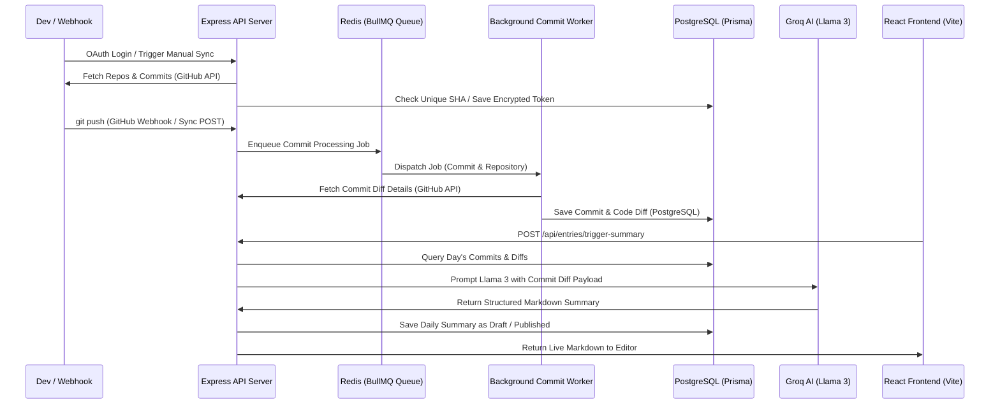

# Devlog 🚀
> **Developer Activity Intelligence Platform — compiling raw commit history and code diffs into structured engineering portfolios.**

Devlog is an intelligent, full-stack platform designed to bridge the gap between low-level version history and professional engineering positioning. It securely ingests a developer's daily commit stream, extracts raw code diff patches, and utilizes advanced LLMs (Groq Llama 3) to compile high-impact দৈনিক journals, architectural milestones, and quantified resume achievements.

Instead of presenting recruiters and hiring managers with a generic contribution grid, Devlog translates engineering contributions into structured narratives, recruiter-friendly skill analytics, and visual development timelines.

---

## 📖 Table of Contents
- [💡 Why Devlog? (The Problem & The Pitch)](#-why-devlog-the-problem--the-pitch)
- [🎮 Demo Sandbox Mode (Zero-Config Start)](#-demo-sandbox-mode-zero-config-start)
- [🛠️ Core Features](#️-core-features)
- [🏗️ System Architecture & Workflow](#️-system-architecture--workflow)
- [💻 Tech Stack & Architectural Reasoning](#-tech-stack--architectural-reasoning)
- [🗄️ Database Schema Model & Design Decisions](#️-database-schema-model--design-decisions)
- [📥 Prerequisites & Installation](#-prerequisites--installation)
- [⌨️ Commands to Run](#️-commands-to-run)
- [🔒 GitHub OAuth & Webhook Setup](#-github-oauth--webhook-setup)

---

## 💡 Why Devlog? (The Problem & The Pitch)
Developers write thousands of lines of code daily, but showcasing their actual contributions has historically been restricted to two subpar choices:
1.  **Raw GitHub Profiles**: Full of green squares but lacking project context. Recruiters cannot parse SHAs, pull request logs, or file refactors to evaluate candidate depth.
2.  **Manual Portfolios**: Beautiful, but require constant manual updates. They are quickly abandoned, leaving them outdated.

**The Solution:**
Devlog operates as a developer activity interpreter. It answers **WHAT** changed and **WHY** it changed. For instance:
*   *Before (Raw Git Commit)*: `fix(auth): remove stale middleware`
*   *After (Devlog Summary)*: `Redesigned JWT verification middleware with Redis-backed revocation to reduce authentication latency and block expired sessions.`

This transforms raw development activity into a readable daily log, a technical skill profile, and an engineering progression timeline.

---

## 🎮 Demo Sandbox Mode (Zero-Config Start)
To allow immediate evaluation of the platform without requiring GitHub OAuth client configurations or active webhooks, Devlog features a built-in **Demo Workspace**:
1.  **Instant Access**: Click the **Launch Demo Workspace** button on the login gateway. This signs you in as a mock developer (`chavaliadi`) and issues local httpOnly cookies.
2.  **Mock Ingestion Sync**: Click **Sync GitHub Commits** inside the dashboard. Instead of calling external GitHub APIs, the backend triggers a mock sync pipeline, loading **24 high-fidelity commits** spread across a 2-week history.
3.  **Live Diffs & AI Compilation**: These mock commits contain actual file change patches (representing real backend constructs like Express routes, AES cryptography, and Redis queue tasks). When you click **Trigger Today's Summary**, the actual **Groq Llama 3 API** compiles the diffs in real-time, allowing you to test the complete, end-to-end pipeline instantly.

---

## 🛠️ Core Features

### 1. Repository Intelligence Dashboard
Analyzes historical commits and repositories to generate an analytical profile of the developer:
*   **Language Distribution**: Computes precise percentages based on files modified in diff logs (e.g. TypeScript vs. Python vs. Prisma SQL).
*   **Skill Category Profile**: Classifies skills into **Backend Engineering, Databases & Caching, Security & Webhooks, and Frontend UI** by scanning commit targets and code imports.
*   **Architectural Pattern Detector**: Highlights patterns implemented in the code (e.g., *Timing-Safe HMAC Webhook Verification*, *Cryptographic Access Token Encryption*, *Event-Driven Async Processing*).
*   **Codebase Metrics Grid**: Exposes the engineering scope of projects by displaying counts of backend modules, API endpoints, Prisma database tables, and message queues.
*   **LLM Evaluation Summary**: Uses Groq completion models to write a professional technical assessment summarizing the developer's strengths.

### 2. Engineering Timeline
A chronological visual roadmap detailing the architectural evolution of the candidate's projects:
*   **Milestone Detection**: Scans commit history to identify major setup benchmarks (e.g., integrating BullMQ, configuring Prisma, introducing JWT).
*   **Architectural Impact Statements**: For each milestone, the system outlines the specific design value (e.g. *OAuth Gateway: "Secures API boundaries and establishes connection protocol to external repository streams"*).

### 3. LLM-Powered Semantic Search
Enables concept-based search over generated devlog entries:
*   Allows querying by concepts (e.g., searching for "revocation" or "distributed queue" yields relevant entries detailing JWT Blacklists or BullMQ workers).
*   Returns **Relevance Scores (1-10)** alongside **AI Match Reason** statements explaining the semantic match.
*   *Implementation Choice*: Avoids vector database and embedding model overhead for smaller developer portfolios (typically < 100 entries) by utilizing Groq's sub-second inference speed to compile relevance mappings dynamically in the backend.

### 4. Resume Bullet Point Generator
Decouples daily technical summaries into standard bullet entries ready for pasting into resumes. Integrates quantitative metrics (e.g., total commits, unique repositories, files modified) and outputs bullet points utilizing active verbs.

---

## 🏗️ System Architecture & Workflow

Devlog is built as a production-grade decoupled backend system, separating latency-heavy tasks (diff downloads, AI completions) from the web server thread.


```mermaid
sequenceDiagram
    participant Developer as Dev / Webhook
    participant Backend as Express API Server
    participant Redis as Redis (BullMQ Queue)
    participant Worker as Background Commit Worker
    participant DB as PostgreSQL (Prisma)
    participant Groq as Groq AI (Llama 3)
    participant UI as React Frontend (Vite)

    %% OAuth and Sync Process
    Developer->>Backend: OAuth Login / Trigger Manual Sync
    Backend->>Developer: Fetch Repos & Commits (GitHub API)
    Backend->>DB: Check Unique SHA / Save Encrypted Token

    %% Ingestion Pipeline
    Developer->>Backend: git push (GitHub Webhook / Sync POST)
    Backend->>Redis: Enqueue Commit Processing Job
    Redis->>Worker: Dispatch Job (Commit & Repository)
    Worker->>Backend: Fetch Commit Diff Details (GitHub API)
    Worker->>DB: Save Commit & Code Diff (PostgreSQL)

    %% Summary Compiling Flow
    UI->>Backend: POST /api/entries/trigger-summary
    Backend->>DB: Query Day's Commits & Diffs
    Backend->>Groq: Prompt Llama 3 with Commit Diff Payload
    Groq->>Backend: Return Structured Markdown Summary
    Backend->>DB: Save Daily Summary as Draft / Published
    Backend->>UI: Return Live Markdown to Editor
```

### Ingest Pipeline & Operational Features
1.  **Authentication & AES Encryption**: Users connect their GitHub account. The backend exchanges the OAuth code for an access token, encrypts it using `AES-256-GCM` authenticated symmetric encryption, and writes it to PostgreSQL.
2.  **Latency Isolation via BullMQ & Redis**: When a webhook is received or a manual sync is clicked, the main Express thread pushes the payload to a **BullMQ queue** and immediately returns a `202 Accepted` response. A background **BullMQ Worker** running on Redis processes the job asynchronously—fetching large text diff files from GitHub and sanitizing metadata.
3.  **DB-Level Idempotency**: Webhook triggers can deliver redundant messages. To prevent duplicate commit processing, a database-level composite unique constraint `@@unique([repository, sha])` is enforced. Ingest jobs violating this are discarded immediately.
4.  **Timezone-Aware Ingestion**: GitHub records commits in UTC, but developer work days span local times. The ingestion pipeline maps commit timestamps using the user's local timezone (e.g. `Asia/Kolkata`) to group daily activities accurately.
5.  **Nightly Cron Scheduler**: A `node-cron` daemon runs hourly, triggering automated Groq AI summaries at exactly 11:00 PM in each developer's configured local timezone.

---

## 💻 Tech Stack & Architectural Reasoning

### 1. Frontend (React, Vite, CSS)
*   **Vite**: Selected for instant development hot reloads (HMR) and optimized build outputs.
*   **React**: Handles state management for the live markdown split-screen editor, commit drawers, and tab routing.
*   **Vanilla CSS (Design System)**: Implements a premium, custom glassmorphic dashboard (Inter font, dark themes, custom scrollbars, glowing metrics cards) using native CSS variables. Avoids Tailwind utilities bloat to guarantee high-fidelity customization.

### 2. Backend (Node.js, Express, TypeScript)
*   **Express & TypeScript**: Delivers typesafe endpoints, custom request context types, and modular middlewares.
*   **Prisma ORM**: Provides clean database schemas and relationships while ensuring typesafe DB queries.
*   **PostgreSQL**: Selected for structural relational constraints (foreign keys, cascading deletes, unique indexes).
*   **Redis & BullMQ**: Implements reliable message queuing and task retries (exponential backoff of 3 attempts, delayed 2s) to handle API throttling.
*   **Groq Completions Client**: Calls the `llama-3.3-70b-versatile` engine over standard fetch APIs. Groq provides sub-second inference speeds, eliminating latency delays during summary generation and semantic searches.

---

## 🗄️ Database Schema Model & Design Decisions

```prisma
datasource db {
  provider = "postgresql"
  url      = env("DATABASE_URL")
}

generator client {
  provider = "prisma-client-js"
}

model User {
  id           String   @id @default(uuid())
  githubId     String   @unique
  username     String   @unique
  email        String?
  avatarUrl    String?
  accessToken  String   // Note: Encrypted using AES-256-GCM for security
  timezone     String   @default("Asia/Kolkata")
  createdAt    DateTime @default(now())
  updatedAt    DateTime @updatedAt
  commits      Commit[]
  entries      Entry[]
  repositories Repository[]
}

model Repository {
  id          String   @id @default(uuid())
  userId      String
  user        User     @relation(fields: [userId], references: [id], onDelete: Cascade)
  fullName    String   // owner/repo
  isTracked   Boolean  @default(false)
  lastSyncAt  DateTime?
  language    String?
  stars       Int?     @default(0)
  createdAt   DateTime @default(now())

  @@unique([userId, fullName])
}

model Commit {
  id          String   @id @default(uuid())
  userId      String
  user        User     @relation(fields: [userId], references: [id], onDelete: Cascade)
  sha         String
  repository  String   // owner/repo
  message     String
  diffText    String?  // Optional - holds commit diff if fetched
  aiSummary   String?  // Per-commit AI explanation of the change (WHY, not just WHAT)
  commitDate  DateTime
  createdAt   DateTime @default(now())

  @@unique([repository, sha]) // Crucial for database idempotency
}

model Entry {
  id        String   @id @default(uuid())
  userId    String
  user      User     @relation(fields: [userId], references: [id], onDelete: Cascade)
  date      DateTime // Scoped summary date
  content   String   // Markdown summary generated by LLM
  status    String   // "draft" | "published"
  createdAt DateTime @default(now())
  updatedAt DateTime @updatedAt
}
```

---

## 📥 Prerequisites & Installation
Before getting started, make sure you have the following installed:
*   **Node.js** (v18.x or higher)
*   **npm** (v9.x or higher)
*   **PostgreSQL** (v17 or higher)
*   **Redis Server** (listening on default port `6379`)

---

## ⌨️ Commands to Run

### 1. Database & Queue Services
Ensure your local PostgreSQL and Redis services are active:
```bash
# Start PostgreSQL (macOS Brew example)
brew services start postgresql@17

# Start Redis
brew services start redis
```

### 2. Backend Setup
1. Navigate to the backend directory:
   ```bash
   cd backend
   ```
2. Install dependencies:
   ```bash
   npm install
   ```
3. Configure your local environment file:
   ```bash
   cp .env.example .env
   ```
   *(Add your `DATABASE_URL` pointing to your PostgreSQL instance, configure port configurations, and add your `GROQ_API_KEY`)*
4. Sync the database schema and seed the initial profile:
   ```bash
   npx prisma db push
   npx prisma db seed
   ```
5. Start the backend development server:
   ```bash
   npm run dev
   ```
   The backend will start and listen on **Port `5005`**.

### 3. Frontend Setup
1. Open a new terminal, navigate to the frontend directory:
   ```bash
   cd frontend
   ```
2. Install client dependencies:
   ```bash
   npm install
   ```
3. Start the Vite React client:
   ```bash
   npm run dev
   ```
   The frontend will start and spin up on **Port `5170`**. 
4. Open your browser and navigate to: **[http://localhost:5170](http://localhost:5170)**.

---

## 🔒 GitHub OAuth & Webhook Setup

### OAuth App Configuration
To register authentication credentials for GitHub logins:
1. Navigate to **GitHub Settings** -> **Developer Settings** -> **OAuth Apps** -> **New OAuth App**.
2. Configure urls:
   *   **Homepage URL**: `http://localhost:5170`
   *   **Authorization callback URL**: `http://localhost:5005/api/auth/github/callback`
3. Generate a **Client Secret** and copy both the **Client ID** and **Client Secret**.
4. Configure your backend `.env` variables:
   ```env
   PORT=5005
   DATABASE_URL="postgresql://<username>@localhost:5435/devlog?schema=public"
   REDIS_HOST="localhost"
   REDIS_PORT=6379
   SESSION_SECRET="your_custom_cookie_session_secret"
   ENCRYPTION_KEY="your_aes_encryption_key_32_chars_long_!"
   GITHUB_CLIENT_ID="your_oauth_client_id"
   GITHUB_CLIENT_SECRET="your_oauth_client_secret"
   GROQ_API_KEY="your_groq_api_key"
   FRONTEND_URL="http://localhost:5170"
   ```

### Webhook Configuration (Optional for real-time push ingestion)
To enable real-time ingestion when code is pushed to your repositories:
1. In your target GitHub repository, go to **Settings** -> **Webhooks** -> **Add Webhook**.
2. Configure webhook properties:
   *   **Payload URL**: `http://your-server-domain/webhook/github` *(use an ngrok tunnel to forward localhost:5005 in dev)*
   *   **Content type**: `application/json`
   *   **Secret**: A custom text token matching the `GITHUB_WEBHOOK_SECRET` in your backend `.env`.
   *   **Events**: Choose `Just the push event`.
